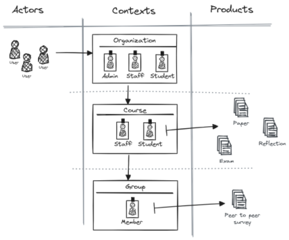

<div align="center">
    
<br />

[cellajs.com](https://cellajs.com) &centerdot; prerelease version &centerdot; MIT license

 &middot; 

</div>

#### Prerelease

> ❗ Please be aware this is a prerelease. It does not meet production requirements yet.

#### Contents
- [Description](#Description)
- [Installation](#Installation)
- [Workflow](#Workflow)
- [Sketch: Hierarchical Structure](#Sketch)
- [Configuration: Hierarchical Structure](#Configuration)
- [Configuration: Access Policies](#AccessPolicies)
- [Configuration: Adapters (optional)](#Adapters)
- [Usage](#Usage)
- [License](#License)

## Description
The permission-manager is a tool designed to facilitate Role-Based Access Control (RBAC) and Attribute-Based Access Control (ABAC) permissions within a hierarchical application structure. 

This first release is primarily integrated with [cella.js](https://cellajs.com/about) and will be utilized for [Shareworks applications](https://www.shareworks.nl/).


## Installation
Install the module via npm:
```bash
npm install --save @cellajs/permission-manager
```

## Workflow

1. **Sketch Hierarchical Structure**

    Define the hierarchical structure of your application, distinguishing between actors, contexts, roles, and products to establish a clear understanding of the system's architecture.

2. **Import and Configure Permission Manager** 
    
    Import and configure the permission manager with the hierarchical structure of your application to begin managing access control.

3. **Configure Access Policies**
    
    Establish access policies based on a many-to-many relationship between different contexts and their corresponding roles, ensuring precise control over permissions.

4. **Optional Adapter Configuration**
    
    Optionally configure adapters to seamlessly integrate the permission manager with other systems or frameworks within your application ecosystem.

5. **Integrate with Middlewares or Application Logic**
    
    Integrate the permission manager into middleware layers or directly into application logic to enforce access control throughout the application's execution flow.

## Sketch
Before configuring the permission manager, it's essential to have a clear understanding of how it integrates into the various components of your application. 
For this purpose, we will sketch a virtual educational app to demonstrate how the configuration will be based on this structure.

<div align="center">
    
</div>

In our educational app scenario, we delineate the actors, roles, contexts, and products to establish a comprehensive hierarchical structure. 
The key components of this structure include:

1. **Actors** 

    Essentially user entities within the system who interact with the application, such as students, teachers, or administrators.

2. **Contexts** 

    Recognizable environments within the application that maintain roles which can be claimed by actors.
    Examples of contexts might include organizations, courses or groups.

3. **Roles** 

    These represent distinct role names available within a context. 
    Roles define the permissions granted to actors within specific contexts. 
    For instance, a "student" role might have permissions to view course materials, while a "teacher" role could have permissions to create assignments.

4. **Products** 

    The tangible elements within the application, such as papers, exams or surveys. 
    Unlike contexts, products do not have roles to claim; they are entities that are accessed and manipulated by actors based on their assigned roles and permissions within the respective contexts.

By outlining these distinctions, we create a blueprint that guides the configuration of the permission manager, ensuring precise control over access and functionality throughout the application.

## Configuration
During the setup of your application, it's recommended to import and configure the permission manager to establish access control mechanisms. 
This ensures that access to different parts of your application is properly regulated based on predefined roles and permissions.

The first step in configuring the permission manager is to communicate the defined hierarchical structure of your application, as outlined in the sketch, to the permission manager module. 
This involves defining the contexts and products that represent the various components and entities within your application.

For this initial configuration, you only need to utilize the Context and Product modules provided by the permission manager. 
These modules allow you to define the organizational structure, roles, and permissions within your application, setting the foundation for precise access control.
  
```js
  // Import or Require
  import { Context, Product } from '@cellajs/permission-manager';

  // Define contexts
  const organization = new Context('organization', ['admin', 'staff', 'student']);
  const course = new Context('course', ['staff', 'student'], new Set([organization]));
  const group = new Context('group', ['member'], new Set([course]));
  
  // Define products
  new Product('paper', new Set([course]));
  new Product('exam', new Set([course]));
  new Product('reflection', new Set([course]));
  new Product('survey', new Set([group]));
```

## AccessPolicies
To configure access policies within the `permission-manager`, follow these steps:

1. **Create a New Instance**: 

    Instantiate a new `PermissionManager` instance.

2. **Configure Access Policies**: 

    Utilize the `configureAccessPolicies` method to set up access policies. 
    This function will be injected with an object containing the subject and the contexts.

```typescript
import { PermissionManager, AccessPolicyConfiguration } from '@cellajs/permission-manager';

// Create a new instance of PermissionManager
const permissionManager = new PermissionManager('guard');

// Configure access policies using the configureAccessPolicies method
permissionManager.accessPolicies.configureAccessPolicies(({ subject, contexts }: AccessPolicyConfiguration) => {

  // Destructure the contexts object
  const { organization, course, group } = contexts;

  // Switch statement to define access policies based on the subject
  switch (subject.name) {
    case 'organization':
      // Define access policies for organization context
      organization.admin({ create: 0, read: 1, update: 1, delete: 0, invite: 1 });
      organization.staff({ create: 0, read: 1, update: 0, delete: 0, invite: 1 });
      organization.student({ create: 0, read: 1, update: 0, delete: 0, invite: 1 });
      break;

    case 'course':
      // Define access policies for course context
      organization.admin({ create: 1, read: 1, update: 1, delete: 1, invite: 1 });
      organization.staff({ create: 1, read: 1, update: 0, delete: 0, invite: 0 });
      course.staff({ create: 1, read: 1, update: 1, delete: 1, invite: 1 });
      course.student({ create: 0, read: 1, update: 0, delete: 0, invite: 0 });
      break;

    case 'group':
      // Define access policies for group context
      organization.admin({ create: 1, read: 1, update: 1, delete: 1, invite: 1 });
      course.staff({ create: 1, read: 1, update: 1, delete: 1, invite: 1 });
      group.member({ create: 0, read: 1, update: 0, delete: 0, invite: 0 });
      break;

    case 'paper':
    case 'exam':
    case 'reflection':
      // Define access policies for paper, exam and reflection products
      organization.admin({ create: 0, read: 1, update: 1, delete: 1 });
      course.staff({ create: 0, read: 1, update: 1, delete: 1 });
      course.student({ create: 1, read: 0, update: 0, delete: 0 });
      break;

    case 'survey':
      // Define access policies for survey product
      organization.admin({ create: 0, read: 1, update: 1, delete: 1 });
      course.staff({ create: 0, read: 1, update: 1, delete: 1 });
      group.member({ create: 1, read: 0, update: 0, delete: 0 });
      break;
  }
});

```


## Adapters
The permission manager expects a specific format for memberships and subjects to check allowances. 
To facilitate this conversion process, you can configure adapters that automatically transform your memberships and subjects into the required format.

```typescript
import { Membership, MembershipAdapter, Subject, SubjectAdapter } from '@cellajs/permission-manager';

// Custom adapter for transforming memberships to the expected format
class AppMembershipAdapter extends MembershipAdapter {
    adapt(memberships: any[]): Membership[] {
        return memberships.map((m) => ({
            contextName: m.type,
            contextKey: m.key,
            roleName: m.role,
            ancestors: m.ancestors || {}
        }));
    }
}

// Instantiate and use the custom membership adapter
const appMembershipAdapter = new AppMembershipAdapter();

// Custom adapter for transforming subjects to the expected format
class AppSubjectAdapter extends SubjectAdapter {
    adapt(s: any): Subject {
        return {
            name: s.type,
            key: s.key,
            ancestors: s.ancestors || {}
        };
    }
}

// Instantiate and use the custom subject adapter
const appSubjectAdapter = new AppSubjectAdapter();
```

## Usage
There are currently two ways to use permission-manager within app logic:

1. **isPermissionAllowed:** Checks if a permission is allowed. It returns a simple boolean. Additionally, it checks the ancestor roles of a subject.

```typescript
const isAllowed = permissionManager.isPermissionAllowed(memberships, 'read', subject);
```
2. **getActorPolicies:** Returns an object with all action allowances and action allowances of child subjects. This object can be used to extend a subject with, for example, a 'canDo' property. This can be utilized on the client-side, so clients don't need to know which role an actor has to determine their permissions

```typescript
const canDo = permissionManager.getActorPolicies(memberships, subject);
```

## License
MIT License

Copyright (c) 2024 @cellajs/permission-manager

Permission is hereby granted, free of charge, to any person obtaining a copy
of this software and associated documentation files (the "Software"), to deal
in the Software without restriction, including without limitation the rights
to use, copy, modify, merge, publish, distribute, sublicense, and/or sell
copies of the Software, and to permit persons to whom the Software is
furnished to do so, subject to the following conditions:

The above copyright notice and this permission notice shall be included in all
copies or substantial portions of the Software.

THE SOFTWARE IS PROVIDED "AS IS", WITHOUT WARRANTY OF ANY KIND, EXPRESS OR
IMPLIED, INCLUDING BUT NOT LIMITED TO THE WARRANTIES OF MERCHANTABILITY,
FITNESS FOR A PARTICULAR PURPOSE AND NONINFRINGEMENT. IN NO EVENT SHALL THE
AUTHORS OR COPYRIGHT HOLDERS BE LIABLE FOR ANY CLAIM, DAMAGES OR OTHER
LIABILITY, WHETHER IN AN ACTION OF CONTRACT, TORT OR OTHERWISE, ARISING FROM,
OUT OF OR IN CONNECTION WITH THE SOFTWARE OR THE USE OR OTHER DEALINGS IN THE
SOFTWARE.

